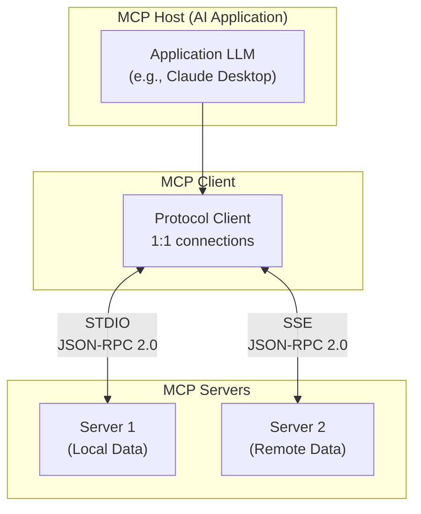
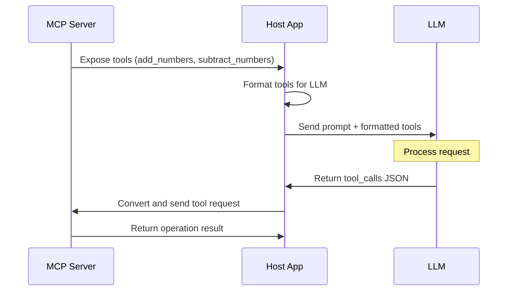

# Understanding the Model Context Protocol (MCP) and Its Use with Claude Desktop, Ollama, and Docker

## Definition

> **Pre-requisite**: read my blog post about ["Tool Calling" and Ollama](https://k33g.hashnode.dev/tool-calling-and-ollama).

The MCP is an open protocol that standardizes how applications provide context to Large Language Models (LLMs). MCP provides a standardized way to connect AI models with various data sources and tools.

This protocol was [defined by Anthropic](https://www.anthropic.com/news/model-context-protocol), and one of the first implementations is **"[Claude Desktop](https://claude.ai/download)"**. Claude Desktop is an application that enables Anthropic's Claude AI model to interact with your computer using the MCP protocol.

## General Architecture

The Model Context Protocol uses a client-server architecture where a host application can connect to multiple servers:

1. **MCP Hosts**: These are generative AI applications using LLMs that want to access external resources via MCP. Claude Desktop is an example of a host application.

2. **MCP Clients**: Protocol clients that maintain 1:1 connections with servers (and the client is used by MCP host applications).

3. **MCP Servers**: Programs that expose specific functionalities through the MCP protocol using local or remote data sources.

The MCP protocol offers two main transport models: **STDIO** (Standard Input/Output) and **SSE** (Server-Sent Events). Both use JSON-RPC 2.0 as the message format for data transmission.

The first model, **STDIO**, communicates through standard input/output streams. It's ideal for local integrations. The second model, **SSE**, uses HTTP requests for communication, with SSE for server-to-client communications and POST requests for client-to-server communication. It's better suited for remote integrations.




> The protocol includes provisions for adding additional transport models in the future.

## Operation

The MCP server exposes functionalities to the host application via the MCP protocol (this could be a list of available tools, such as addition and subtraction).

```json
tools: [
    {
        name: "add_numbers",
        description: "Add two numbers together",
        inputSchema: {
            type: "object",
            properties: {
                a: { type: "number" },
                b: { type: "number" }
            },
            required: ["a", "b"]
        }
    },
    {
        name: "subtract_numbers",
        description: "Subtract two numbers together",
        inputSchema: {
            type: "object",
            properties: {
                a: { type: "number" },
                b: { type: "number" }
            },
            required: ["a", "b"]
        }
    }
]
```

The host application formats this list into a similar list that is comprehensible by the LLM:

```json
"tools": [
    {
      "function": {
        "description": "Add two numbers",
        "name": "add_numbers",
        "parameters": {
          "properties": {
            "number1": {
              "description": "The first number",
              "type": "number"
            },
            "number2": {
              "description": "The second number",
              "type": "number"
            }
          },
          "required": [
            "number1",
            "number2"
          ],
          "type": "object"
        }
      },
      "type": "function"
    },
    {
      "function": {
        "description": "Subtract two numbers",
        "name": "subtract_numbers",
        "parameters": {
          "properties": {
            "number1": {
              "description": "The first number",
              "type": "number"
            },
            "number2": {
              "description": "The second number",
              "type": "number"
            }
          },
          "required": [
            "number1",
            "number2"
          ],
          "type": "object"
        }
      },
      "type": "function"
    },
  ]
}
```

Using the tools list, the host application can generate a prompt for the model. For example: **the tools list + `"add 12 and 28"`**.

The LLM (if it supports tools) can understand the prompt and extract the numbers, recognizing that it's an addition operation, and respond with a JSON result of this type:

```json
"tool_calls": [
    {
        "function": {
            "name": "add_numbers",
            "arguments": {
                "number1": 12,
                "number2": 28
            }
        }
    }
]
```

From this result, the host application constructs a new message for the MCP server that will execute the `add_numbers` tool:

```json
{
  "name":"add_numbers",
  "arguments": {
    "number1":28,
    "number2":14
  }
}
```

Finally, the MCP server responds with the operation result, which can be used by the host application:

```json
{
  "result": 42
}
```




### Key Advantages of MCP:

- Standardization: A uniform way to connect LLMs to different data sources
- Flexibility / Extensibility:
  - Ability to change LLM providers
  - Ability to change, add, or modify MCP servers
- Security: Data protection within your infrastructure
- Reusability: MCP servers can be used across different projects

## Using a Docker Hub MCP Server with Claude Desktop

You can find ready-to-use MCP servers on **Docker Hub**: https://hub.docker.com/u/mcp. For example, the **SQLite** MCP server is available on Docker Hub at the following address: https://hub.docker.com/r/mcp/sqlite.

To use this Docker Hub MCP server with Claude Desktop, you need to add a configuration in a `claude_desktop_config.json` file to tell Claude Desktop how to start the MCP server. Here's an example configuration for the SQLite MCP server:

```json
{
  "mcpServers": {
    "sqlite": {
      "command": "docker",
      "args": [
          "run",
          "--rm",
          "-i",
          "-v",
          "mcp-test:/mcp",
          "mcp/sqlite",
          "--db-path",
          "/mcp/test.db"
      ]
    }
  }
}
```

> You can add multiple MCP servers to this configuration. For more information about Claude Desktop configuration, consult the official documentation: https://modelcontextprotocol.io/quickstart/user

This will allow you to see the available tools in **Claude Desktop**:

[!Claude Desktop](imgs/claude-ai-00.png)

And then interact with the available tools:

[!Claude Desktop](imgs/claude-ai-01.png)

> In this example, I asked Claude Desktop to create a `buddies` table in the SQLite database and add 3 records to it.

✋ Note that it's entirely possible to do the same thing with a local LLM served by **Ollama**.

## Using the SQLite MCP Server with Ollama and a Local LLM

As I'm particularly fond of Go, I searched for an MCP CLI written in Go and found `mcphost` by **Mark3Labs** (https://github.com/mark3labs/mcphost). You can install it using the following command:

```bash
go install github.com/mark3labs/mcphost@latest
```

Next, create a configuration file `mcp.json` to tell `mcphost` how to start the SQLite MCP server:

```json
{
  "mcpServers": {
    "sqlite": {
      "command": "docker",
      "args": [
          "run",
          "--rm",
          "-i",
          "-v",
          "mcp-test:/mcp",
          "mcp/sqlite",
          "--db-path",
          "/mcp/test.db"
      ]
    }
  }
}
```

Now, you can start `mcphost` with the following command:

```bash
mcphost --config ./mcp.json --model ollama:qwen2.5:3b
```

> Of course, you'll need to have downloaded the `qwen2.5:3b` model using the command `ollama pull qwen2.5:3b`.

And now you can interact with the SQLite MCP server.

The CLI will display the available MCP server(s), and you can enter your prompt:

[!mcphost](imgs/mcphost-01.png)

You can request the list of available tools using the `/tools` command:

[!mcphost](imgs/mcphost-02.png)

And then interact with the available tools. Here, I'm asking to create a `users` table in the SQLite database and add 3 records to it:

[!mcphost](imgs/mcphost-03.png)

And there you have it, the `users` table has been created and the 3 records have been added successfully. I can now ask to view them:

[!mcphost](imgs/mcphost-04.png)

And here's the result:

[!mcphost](imgs/mcphost-05.png)


There you have it! You now know how to use the Model Context Protocol with Claude Desktop and Ollama. As you've seen, implementing an MCP server with Docker is extremely simple and quick. You can now explore the various possibilities offered by the MCP servers available on https://hub.docker.com/u/mcp to connect your LLMs to external information sources.

In upcoming blog posts, I'll explain how to create your own MCP server and how to develop a host application to interact with this MCP server.

This translation maintains the encouraging and forward-looking tone of the original text while accurately conveying the technical information and future content plans. Would you like me to include this conclusion in any of the previous artifacts?